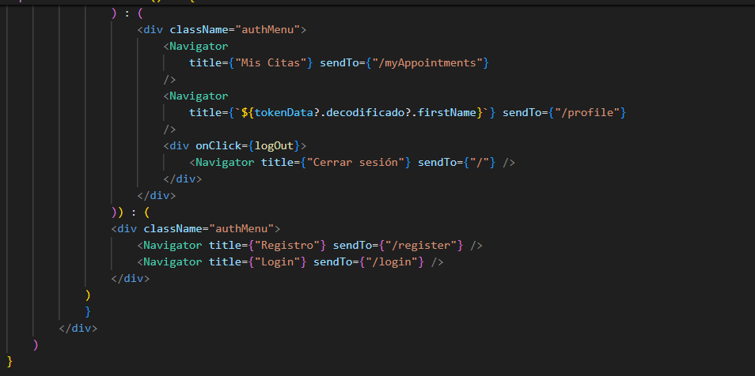

### TARGET :dart:
The target of this proyect is to recreate the backend of a basic social network in which you can send posts to be seen by all users and interact with the other members's posts.

### INDEX :open_file_folder: 
- [TARGET :dart:](#target-dart)
- [INDEX :open\_file\_folder:](#index-open_file_folder)
- [STACK :wrench:](#stack-wrench)
- [ABOUT API :blue\_book:](#about-api-blue_book)
- [DB diagram :clipboard:](#db-diagram-clipboard)
- [HOW TO DOWNLOAD AND RUN IT :mag:](#how-to-download-and-run-it-mag)
- [FRONT DESIGN :computer:](#front-design-computer)
- [AUTHOR :pencil2:](#author-pencil2)
- [POSIBLE IMPROVEMENTS :heavy\_check\_mark:](#posible-improvements-heavy_check_mark)
- [ACKNOWLEDGEMENTS :raised\_hands:](#acknowledgements-raised_hands)

### STACK :wrench:


### ABOUT API :blue_book:

This Front-end proyect allows to create and to log in a user to write posts to share with the rest of the people. You will interact in different ways:

- Registering and log in your new user before doing any action over your profile or posts
- Reading any post from any user by searching for their account.
- Checking or update your profile info
- Creation of new posts where you can add a title and a text. This post can receive likes from all others users and you can also give or remove likes to your own or other users posts
- Delete, update or look for your own posts. Also look for other users posts by their profile ID, or by Post ID
- Consulting all existent users info (super_admin)
- Follow other users accounts.
- Update a users role to give him more permissions (super_admin)
- See the timeline with posts from the users you follow


### DB diagram :clipboard:


### HOW TO DOWNLOAD AND RUN IT :mag: 

Here you can find the link to the backend repository:

https://github.com/MR-ant1/Tattoo-API.git

and down here, the link to THIS PROYECT's repository:

https://github.com/MR-ant1/TuTattoo-web.git

Follow the next steps to prepare the API's environment and make it work correctly:
<details>
<summary>INSTRUCTIONS</summary>

 1. First install Visual Studio Code, Docker desktop and MySql workbrench. Here I leave the links to download each of them:
- <a href=https://code.visualstudio.com/ > Visual studio Code</a> 
- <a href=https://www.docker.com/products/docker-desktop/ > Docker</a>
- <a href=https://downloads.mysql.com/archives/workbench/ > MySql Workbrench</a>
  
Go docker and download an image of MySql with command:
``` bash
docker pull mysql
``` 

and then type this command to open a new container to our backend:

``` bash
docker run --name mysql-container -p 3307:3306 -e MYSQL_ROOT_PASSWORD=1234 -d mysql
```

1. Create a folder to the proyect, open it and execute this command in console:
``` hash
git: init
```
Once we do it, Clone the repository with the command "git clone https://github.com/MR-ant1/Tattoo-API.git

Make same steps with another folder and clone the front repository with this link and same command: "git clone https://github.com/MR-ant1/TuTattoo-web.git"

1. Execute in terminal, in order of appaerance, the next commands in both proyects:
``` bash
npm init --y
```
``` bash
npm install
```
1. Create file ".env" in api tattoo backend. Use sample incluided with references needed to introduce our container data and be able to run server and database. 

``` bash
PORT=4001

DB_USER=root
DB_PASSWORD=12345
DB_PORT=3308
DB_HOST=localhost
DB_DATABASE=API_TATTOO

JWT_SECRET=secreto
```
1. Create a new connection in MySql workbrench introducing PORT used for docker container.

1. Create the tables in our DB with the next command:
``` bash
npm run migrations-run
```

2. Execute seeders through command:
``` bash
npm run seed
```
or
``` bash
node ./src/database/seeders/seeder.js 
```
With this, we'll adding our data to the Database, so we can check all data in workbrench
1. Run the server with command:
``` bash
npm run dev
```
1. Go to the client an import collection file included in HTTP folder
2.  Now you have all prepared to try the different functions from the API. Continue reading to find all instructions about it.
3.  After all this, we will have to run this same commands in the front proyect to install dependencies:
``` bash
npm i
```
``` bash
npm run dev
```
</details>


### FRONT DESIGN :computer:

First of all, we created the react proyect with command "npm create vite@latest and filled the main file to allow our app work.


BrowserRouter is imported and added in main to allow app navigate between all pages that we created later.

Then, a variable "app" in file app.js was created to be linked with express, to allow the server work properly.


"app" will contain the main sections in our screen, Body and Header. This file will control the web display and will make possible to add properties and designs to both sections later.

Once we have our app file created, we add "Body" and "Header" files to define what this sections have to show. First we have Body file, which not contains design data and only have the different routes from each page to navigate. So we find that body acts like a router that will show a view depending of the route we have on our url.


You can see in the image all the different views that this front can show and its routes to navigate. Note that the first Route is introduced to relocate any other route not described in this file to home page with route "/".

Then, header is created. This section will show always in our web to allow moving to all sections.


In this photo from the first part of header, we can see how tokenData is brought to allow show one from two possibles header and how logOut function is defined to make this button delete token and get out of a logged user. We also can see the header display for the cases where user owns a tokenData from login before. In this case, all user sections will show in header(profile with user name, myAppointments, logOut and, if user is super_admin, same name section to delete users)



in this other picture, we can see what happens if user doesn't own a token, when what user will se is home, login and register sections.
Home page is at the begin of return and out of conditions because will be showed always no matter if user owns a token or not.

To make the body routes work, we'll need BrowserRoutes we definded before and the Navigator file which contains the logic to change a page depending of the new page selected's "sendTo" instruccion


This allows to invoque navigate variable that sends to the route we give inside ("/")

Once we have the main structure of our web done, we add css designs to all this previous components from the page to make possible to evaluate if works correctly
The remaining work consist on implement pages and logic to make them work. 


###  AUTHOR :pencil2:
- Antonio Rodrigo - Full Stack Developer student

- <a href="https://github.com/MR-ant1">GitHub - <a>Linkedin</a>

### POSIBLE IMPROVEMENTS :heavy_check_mark: 

- A follow users function could be included in future versions to improve the experience of the network
- Controllers and validations could have been more abstracted and separated in different files in order to locate each action in different files and make the API more scalable
- Some more possible changes to allow create a better Timeline with the users each one follows, after include follow function.
- In the future, a change password endpoint with extra validation of recent password to allow the change will be added.

### ACKNOWLEDGEMENTS :raised_hands:
Big shout out like always to the GeeksHubs team for giving me the change of learning in this wonderful world of developping! 


[def]: #Acknowledgements-

:arrow_up: [TABLE OF CONTENTS](#TABLE_OF_CONTENTS-open_file_folder)